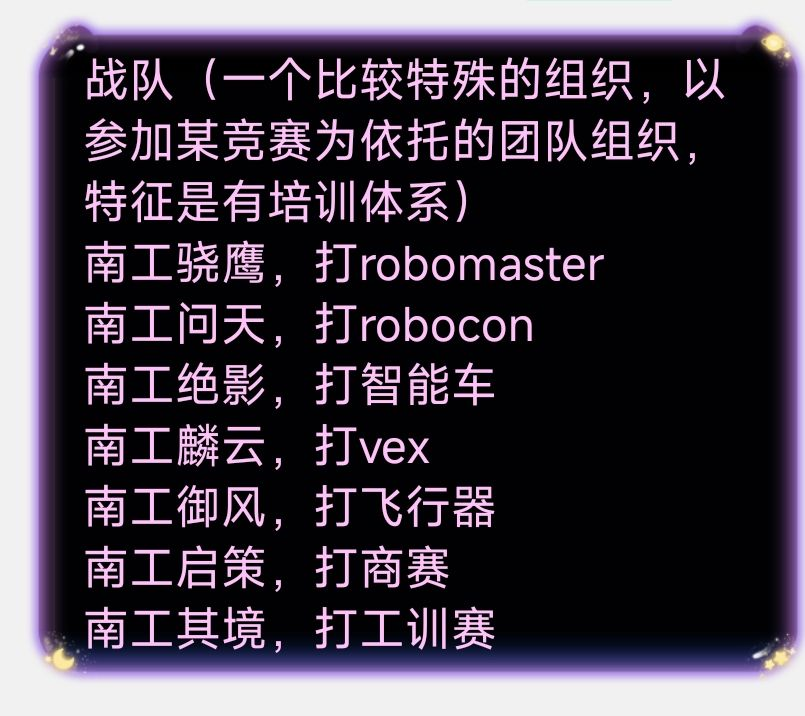

## 引言

笔者是现大二计科专业就读，所以以下建议/经验可能更加适合计科学生（如果有什么片面，不妥的说法可以随时di我修正）。然后此文基于我大一的经验视角分享，希望对同学们有一定的帮助。

很久就打算写这篇博客了（，但是最近和很多小灯聊天继续在完善自己的想法，然后发现同学们的问题主要集中在几个方面——保研，竞赛，科研，就业。恰好我都有对应的一些经验，但是都不是顶尖的那一批，所以就简单的分享一下自己的看法，就按照小灯的问题来大致分享一下

## 关于绩点

在大学体系内，这个可能是最重要的一点，因为这个是量化学习成果的重要指标，在我们学校主要指的就是学分绩。首先，学分绩与很多东西挂钩——推免名额，评奖评优，入党考察，甚至部分科研组和实习公司也有绩点要求。所以把它放在第一个位置是因为它确实重要而且影响极大，可能单靠学分绩就能在学校体系内混得不错，因为各项评比都有较好的优势，当然因为专业人数居多，不是每一个人都能在专业前百分之五甚至更前。

所以造成了很多问题，或许是理工类大学不可避免的，绩点的绝对权威化。和不少老师也聊过，学校推行的教考分离导致上课真正对学习成果的量化可能不如自己自学或者多刷几套题来的多，导致大学变成大号高中，评判维度扁平化，往往就是一次考试定输赢的，这对于见惯高中体系的我们来说是十分厌恶的。当然在这里不是否认绩点的合理性，因为确实需要一个指标来衡量学生的学习成果，而对于我们学生来说，如果目标一定是保研评奖的话，绩点是最清晰最明确的道路了。

我自己的经验就是将较少的时间放在绩点上，将更多的时间放在可能感兴趣的地方，大概就是期末或者学期前认真速通一下，这里推荐kajimi学习法。当然看自己能否做到，就是在期末前五天左右关闭所有可能影响的因素全身心备考。当然有部分考试不建议速通，这里也看同学们自主衡量。不同的人对绩点有不同的看法，也不宜讲太多。

## 关于竞赛

然后就是很多同学关注的竞赛，因为大部分咨询我的其实是关于竞赛的问题，所以这部分会相对较长一点，可能也是主体部分。首先了解我们为什么要打竞赛，通过和同学们了解大概就是，保研升学，以赛促学，丰富简历这样的。

从功利的角度，小部分比赛享有保研加分，而且是保研加分里面相对简单的栏目，这也是绝大部分人打比赛的原因（我最开始也是这个目的打的比赛），后来发现我的目标已经不是保研了，那我就打算做一些真正喜欢的事，事实证明做喜欢的事情的时候是特别快乐的，而且不会有怨言。

然后，竞赛分为很多类，具体的可以大致参考保研细则的竞赛说明部分。首先推荐的几个有含金量的比赛就是学校各大战队的机器人类的比赛，对于所有专业的同学来说都是不错的经验，笔者曾经参与过南工绝影的战队培训，虽然后来小车赛入围后弃赛了，但是也是宝贵的实战经验。然后主要的战队：

然后就是看自己的兴趣，有计算机相关的比赛如系统赛和xcpc（算法竞赛）这种保研加分的，也有像asc（高性能计算）这种没有保研加分的，很多比赛没有官方报名渠道，靠同学自己了解并且组队和老师沟通，然后再以学校的名义参加比赛，大部分也都是放养也要靠自己自学。相对于战队来讲，这种比赛的劣势在于没有完善的培养体系，全靠自己的摸索，所以难度会相对偏大。

如果目的是保研加分的话，可以看看保研细则里面的说明，然后按照表单一个个打听了解，比赛很多我也不全了解。最后是讲一下小灯普遍有顾虑的问题：我们是大一，之前没有基础，能不能直接上手。然后我一般会把他们引流到各大战队，战队都是零基础培养，绝大部分都是没有相关经验的，毕竟大家都是高中体系里进来的。其实就算按照学校的正常安排，到了大二也不见得真的会相关的内容，所以可以放心大胆冲。不用担心学不会，真学不会的话有老登的亲自拷打，包你在重重压力下充满学习动力（,加入战队也不能高枕无忧了，哪里都有竞争，消极的注定走不长远。

然后由于毕业也有创新学分要求，有几个必吃榜可以尝试，一个是数竞，无论是大一大二都可以尝试，提前速通一下高数即可，然后就是各学部组织的比赛，都是特别不错的赚创新学分的机会。数模因人而异，因为这个比赛耗费的精力不小。还有一些网络上的比赛，都是可以报名的，多多尝试试错才是大一该干的事情。如果还有什么可以补充的可以联系我补充说明一下。

然后我的比赛经验是大一上在南工绝影，寒假参加了线上的CTF比赛和学习web前后端的知识，大一下期末参加了系统赛，暑假参加了HPC相关的比赛，还有一些零零散散的数模数竞。总之多多尝试总是好的。

## 关于科研

这部分其实我不太好讲太多，因为我个人的经验不太好复刻，正常的流程应该是要先在我们的哈工大教师主页上看喜欢方向的导师，然后尝试写邮件沟通。导师可能会安排面试或者谈话，然后科研也分是否培养，大部分情况是先挂名，然后你自主学习，然后有了一定能力可以让师兄师姐帮忙带一带。

然后要学会对科研祛魅，科研并不是什么高大上的东西，和竞赛一样，本质也是时间和能力的投入，大部分组对本科生都是比较友好的，具体情况可以和学长了解一下或者自主查询相关信息。包括科研和就业开始就要善于表达自己，这个时候，学会表达比学习能力更加重要。

也有小灯问我推荐哪个老师，这个我确实不方便说，因为每个组别的风格不同，方向不同，全靠自主了解。我个人特别喜欢我的研究组，因为我可以占用组内全部的计算资源（，然后就是一样的问题，年级低不是问题，敢于尝试，不要轻易给自己设限。

## 关于实习就业

实习也是很多同级同学在问的问题，对于计算机专业来讲，实习的工作经验比科研/竞赛/绩点来的更加重要，当然，技术岗普遍是这样的。所以先定下自己的方向然后找到第一份实习尤为重要，这个和技术栈有较大的关联，我个人认为，前面三项的全部努力都是为了最后的实习，积累经验，打磨技术栈。真正的计算机科研人才是极为稀少的，最后的目的都是进入企业进行工业落地，所以工作经历尤为重要。

现在AI时代，你可能会问有什么工作值得，有什么不会被AI替代，答案是没有工作不会，所有的工作都面临AI的冲击，无非是多少的问题。但是AI是工具，就像几百年前的纺织机一样，学习它，驾驭它，提升自己的竞争力。

然后就根据我自己的视角来讲一下怎么找到的第一份实习，我的实习之路其实是比较陡峭的，大一上学期末，我就投了腾讯华为等几家公司的日常实习，可想而知都没有进简历关，资历小，技术基础薄弱都是问题。资历不足无法解决，但是也留了足够的时间来丰富简历。在大一下开始，我开始接触csapp，从油管的core dumped栏目开始，一步步接触计算机设计底层。偶然间，我接触了在当时并不火爆的AI infra，发现与自己的学习路径极为相似。深入了解，了解了vllm，HPC等等，后续也参加了相关的一些比赛。认识了行业内的一些顶尖的朋友们，其中对我影响最大的是来自西南石油的一位朋友，他从大二上开始前往北京拿下第一段小厂实习，然后凭借工作经验和极强的知识储备先后拿下国内多个大厂的offer，我终于意识到学历不是枷锁，傲慢和胆怯才是。

大二暑假原计划实习，后来比赛科研推迟了，但是也积累了充足的项目经历，简历上写的经历几乎都是一个暑假完成的，直到大二开学才拿到人生中第一次offer，是推理优化方向的AI infra工程师，在一家初创小公司。此前我也投递了腾讯，字节，商汤的相关岗位，不过因为过了黄金时期，所以直接进了人才库（。后续又投了几家小厂，第一家比较敷衍，闻所未闻的用微信语音面试，虽说过了二面，但是好像因为没有hc挂了，第二家面的是vivix ai，初面是hr面，也是奇奇怪怪，问了世界模型相关的知识，但是我确实没有相关了解，也是直接挂了，第三家就是现在这家公司了，正常的笔试一面二面，笔试的内容还好，一个分块卷积算子，一个矩阵乘算子，一个线程安全队列。在一面的时候表现不错（当时说了很多比赛时的思路，感觉是工程思维加分），进入二面。因为我的简历稍微有点与年级不匹配，二面直接是ceo面了，但是此前我也不知道，在二面结束后才告诉我，很愉快，感受到了核心团队的技术能力。毕竟只是想要打磨技术能力，所以就停下来了，至少先干三四个月再说。

实习经历因人而异，机遇不同，选择不同，表现不同，都有不同的结果，虽然没有过vivix ai面试，但是也收获到了良好的反馈——学会表达自己，技术强者需要良好的表达让别人知道。也有可能是我在后面一家公司取得良好结果的原因之一吧。

但是这条路毕竟不是学校推举的，只能简单分享一下自己的经历。但是总归不能一直在学校的体系中，最终都是要进入社会的。当然最终都是看自己的选择，“道法三千六百门，人人各执一苗根”（取自十日终焉），最终的路如何，自己都有绝对的解释权。

这里顺便宣传一下我的简历模版仓库：[简历模版](https://github.com/IceFerryLing/resume)

## 结语
其实说了这么多，核心就是一句话：大学从来没有标准答案。

绩点、竞赛、科研、实习，没有哪条是必走的路，也没有哪条更高贵。大一最值钱的就是试错的机会，不用怕零基础，不用跟风焦虑，更别给自己设限。

按自己的节奏走，想做的事大胆去做就够了。